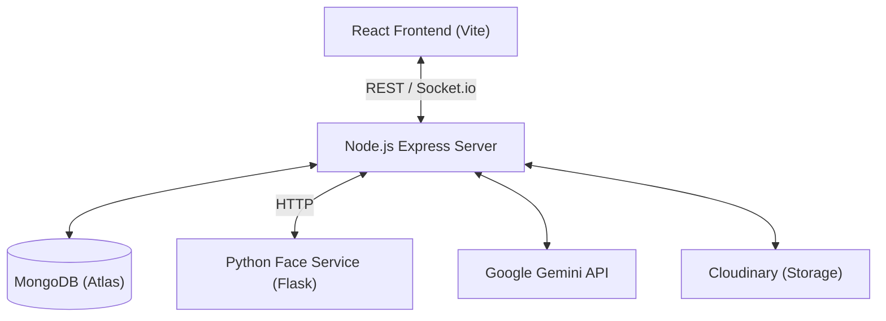

# AI Attendance & Smart Education Platform - Documentation

Comprehensive technical documentation for the Smart Education Platform, featuring AI-based face attendance, real-time notifications, and Gemini-powered academic assistance.

---

## 🏗️ Architecture Overview

The system follows a decoupled, service-oriented architecture:



### Component Breakdown
1.  **Frontend**: Single Page Application (SPA) built with React and Vite. Uses Tailwind CSS for styling and Socket.io-client for real-time features.
2.  **Backend**: RESTful API built with Express.js. Handles business logic, authentication (JWT), and orchestrates AI/Face services.
3.  **Face Service**: A Python microservice dedicated to biometric processing. Support for both `face_recognition` (dlib) and `DeepFace` frameworks.
4.  **Database**: MongoDB for persistent storage of users, attendance records, marks, and notes.

---

## 📡 Backend API Depth

### 🔐 Authentication (`/api/v1/auth`)
- `POST /register`: User registration (Role-based).
- `POST /login`: JWT-based authentication.

### 👥 User Management (`/api/v1/user`)
- `GET /profile`: Fetch current user data.
- `PUT /profile`: Update bio/avatar (Cloudinary integration).
- `GET /students/:classId`: List students in a specific class.

### 📸 AI Face Attendance (`/api/v1/face-attendance`)
- `POST /register-face`: Send student face images to Python service for encoding.
- `POST /mark-attendance`: Real-time recognition and marking of attendance.
- `GET /health`: Integration status with Python microservice.

### 📝 Academic Services
- **Attendance (`/api/v1/attendance`)**: Manual & QR-supported sessions.
- **Marks (`/api/v1/marks`)**: Upload, view, and notify students of results.
- **Notices (`/api/v1/notices`)**: Announcement system with real-time push.
- **Notes (`/api/v1/notes`)**: Collaborative study materials.

### 🤖 AI Tutor & Coach (`/api/v1/ai`)
- `POST /chat`: General AI assistant (Gemini Flash).
- `POST /explain`: Simplified explanations of complex notes.
- `POST /quiz`: Auto-generates MCQ quizzes from study materials.
- `POST /analyze`: Performance coaching based on marks history.

---

## 🗄️ Data Schema (MongoDB Models)

### `User`
- **Fields**: `name`, `email`, `password`, `role` (student/teacher/admin), `classId`, `assignedSubjects`, `avatar`, `bio`.
- **Logic**: Uses Bcrypt for password hashing. Role-based fields for class/subject associations.

### `AttendanceRecord`
- **Fields**: `sessionId`, `studentId`, `attendanceType` (qr/face), `confidence`, `status`, `markedAt`.
- **Integrity**: Unique index on `[sessionId, studentId]` to prevent proxy/duplicate attendance.

### `Mark`
- **Fields**: `studentId`, `subjectId`, `examType`, `marksObtained`, `maxMarks`, `uploadedBy`.
- **Feature**: Virtual field for automatic percentage calculation.

---

## 🐍 Python Face Service Logic

The project includes two processing engines in `face-service/`:

1.  **Standard Engine (`app.py`)**: Uses the `face_recognition` library. Calculates a 128D encoding and uses HOG/CNN for detection.
2.  **Deep Learning Engine (`app_deepface.py`)**: Uses `DeepFace` with `Facenet` model. Includes **AES-256 encryption** for biometric embeddings to ensure privacy and security.

### Biometric Workflow
- **Registration**: Captures 5-15 images → Generates embeddings → Averages them for a "centroid" representation → Saves encrypted pickle.
- **Recognition**: Live frame → Encoding → L2 Norm Distance calculation against database → Threshold (Strict < 0.5) → JSON response to Node.js backend.

---

## 💻 Frontend Implementation

### Core Technologies
- **Styling**: Vanilla CSS + Tailwind.
- **Visuals**: `ogl` library for the **DarkVeil** glassmorphism background effect.
- **Real-time**: `SocketProvider` context for global notification handling.

### Routing & Security
- **Protected Routes**: Wraps sensitive pages based on `allowedRoles`.
- **Navigation**: Lateral Sidebar for authenticated users.

---

## 🚀 Setup & Deployment

### Environment Variables (.env)
```env
MONGODB_URI=...
JWT_SECRET=...
CLOUDINARY_URL=...
GEMINI_API_KEY=...
PYTHON_SERVICE_URL=http://localhost:5001
PORT=5000
```

### Installation
1.  **Backend**: `npm install` && `npm start` (Port 5000).
2.  **Frontend**: `npm install` && `npm run dev` (Port 5173).
3.  **Face Service**: `pip install -r requirements.txt` && `python app.py` (Port 5001).

---

## 🛠️ Debugging & Health Checks
- Backend Health: `http://localhost:5000/api/v1/face-attendance/health`
- Face Service: `http://localhost:5001/health`
